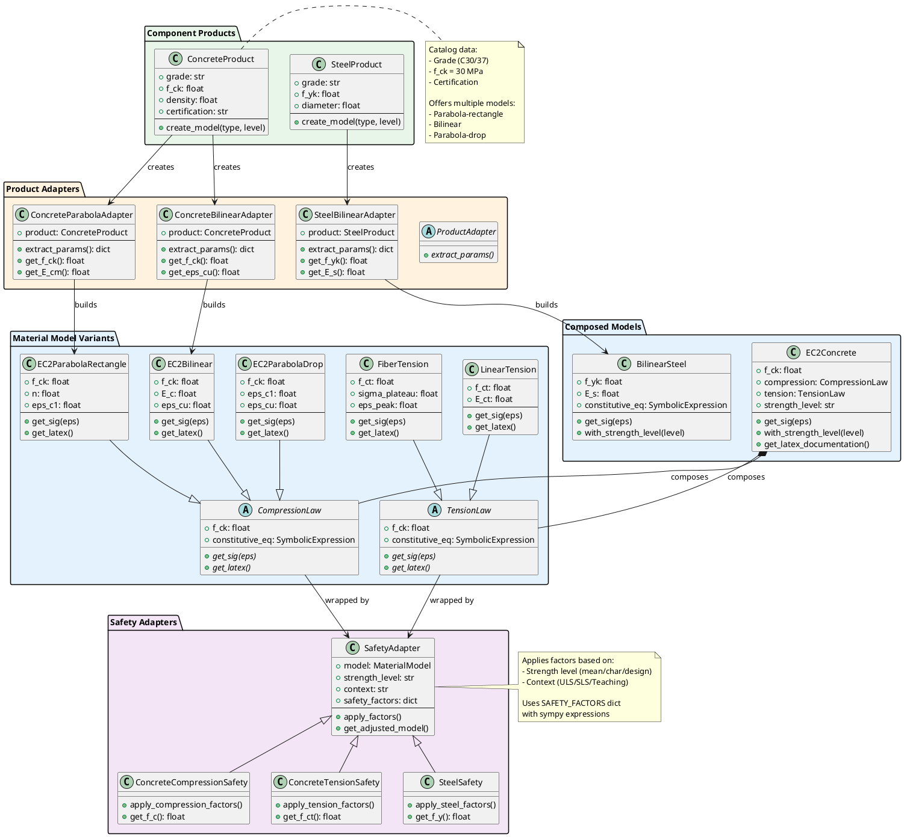

# Material Architecture Strategy

**Date:** January 20, 2026  
**Status:** 🎯 Active Planning - Core Architecture Design  
**Priority:** High - Foundation for next development phase

---

## The Triangle: Product - Material Model - Safety Concept - Use Case

### Core Challenge

We need a clear architecture that separates:

1. **Material Products** (catalog components)
   - Manufacturer specifications
   - Characteristic values (test data, 5% fractile)
   - Certification marks
   - Physical dimensions

2. **Material Models** (constitutive laws)
   - Stress-strain relationships
   - Mathematical formulation
   - Numerical properties

3. **Safety Concept** (code requirements)
   - Partial safety factors (γ_c, γ_s)
   - Load factors
   - Long-term reduction factors
   - Context-specific modifiers

4. **Use Cases** (application context)
   - **ULS Design**: Design values (f_cd, f_yd)
   - **SLS Verification**: Characteristic values (f_ck, f_yk) or mean values
   - **M-κ Teaching**: Characteristic values with visible safety factors
   - **Research/Analysis**: Mean values, parametric studies

---

## Current State Analysis

### What Works Well ✅

**1. Component Catalog System:**
```python
# Products store characteristic values
@dataclass
class SteelRebarComponent:
    nominal_diameter: float
    f_yk: float = 500.0  # Characteristic yield strength [MPa]
    grade: str = "B500B"
    
# Clear product → material model link
rebar = SteelRebarComponent(diameter=12)
steel_matmod = create_steel(rebar.grade)
```

**2. Separation: Components vs Models:**
- Components in `cs_components/` (products)
- Material models in `matmod/` (constitutive laws)
- No confusion between product and behavior

### What Needs Improvement 🔧

**1. Concrete Material Model - Hidden Semantics:**
```python
class EC2Concrete:
    f_ck: float = 30.0  # Input: Characteristic
    
    def get_sig(self, eps):
        # PROBLEM: Uses f_cm = f_ck + 8 internally!
        # User expects f_ck behavior, gets f_cm
```

**Issue:** The `get_sig()` method uses **mean strength** (f_cm), not characteristic (f_ck).  
**Why:** EC2 parabola-rectangle diagram is calibrated for mean values.

**2. Ambiguous Safety Factor Application:**
```python
# Current approach - unclear semantics
concrete = EC2Concrete(f_ck=30, factor=0.85)  # What does 0.85 mean?
# Is it: α_cc? Long-term reduction? Safety factor? Design conversion?
```

**3. No Use-Case Context:**
- Model doesn't know if it's being used for ULS, SLS, teaching, research
- Same material used in different contexts without clear distinction
- User can't tell what strength level is active

---

## Proposed Solution: Decomposed Material Models

### Inspiration: Legacy Concrete Structure

The original `concrete_matmod.py` had a good pattern:

```python
class ConcreteMatMod(MatMod):
    """Composed Concrete Material Model"""
    
    compression = EitherType(options=[
        ('piecewise-linear', ConcreteCompressionPWL),
        ('EC2 with plateau', ConcreteCompressionEC2Plateau),
        ('EC2', ConcreteCompressionEC2)
    ])
    
    tension = EitherType(options=[
        ('piecewise-linear', ConcreteTensionPWL)
    ])
    
    def get_sig(self, eps):
        return np.where(eps > 0,
            self.tension_.get_sig(eps),
            self.compression_.get_sig(eps)
        )
```

**Benefits:**
- Separate tension and compression laws
- Mix-and-match for special cases (e.g., fiber-reinforced tension + standard compression)
- Fewer material model variants needed
- Clear mathematical structure

### Architecture Pattern: Dual-Adapter System

```
Component Product (Catalog)
         ↓
    [Product Adapter] ← selects parameters for specific model type
         ↓
Material Model Variant (with sympy equations)
         ↓
    [Safety Adapter] ← applies strength level transformations
         ↓
Material Model in Context (ready for cross-section)
```

**Detailed Flow:**

1. **Product** → stores characteristic values (f_ck, f_yk, etc.)
2. **Product Adapter** → extracts model-specific parameters
3. **Model Variant** → implements constitutive law (sympy-based)
4. **Safety Adapter** → applies safety factors for context
5. **Model in Context** → used in cross-section calculations

This enables:
- Multiple model types per material (parabola-rectangle, bilinear, etc.)
- Multiple safety levels per model (mean, characteristic, design)
- Composability: mix different compression/tension laws
- Clear separation: product data ≠ model behavior ≠ safety context

---

---

## Refined Architecture: Multi-Model Material System

### Visual Documentation

**Architecture Diagrams:**
1. **Class Structure:** [`material_architecture.puml`](material_architecture.puml) - Complete class hierarchy, relationships, and component interactions
2. **Creation Flow:** [`material_flow_diagram.puml`](material_flow_diagram.puml) - Step-by-step sequence showing dual-adapter pattern in action

You can render these diagrams using:
- VS Code PlantUML extension
- Online: http://www.plantuml.com/plantuml/
- Command line: `plantuml *.puml`

### PlantUML Class Diagram

**Full diagram available in:** [`material_architecture.puml`](material_architecture.puml)

**Quick overview:**



### Material Model Variants for Concrete Compression

**1. Parabola-Rectangle (Standard EC2):**
```python
class EC2ParabolaRectangle(CompressionLaw):
    """
    EC2 standard parabola-rectangle diagram
    Continuous curve, no drop
    """
    constitutive_eq = SymbolicExpression(
        expr='f_c * (1 - (1 - eps/eps_c1)**n)  if eps <= eps_c1 else f_c',
        latex_str=r'''
        \sigma_c = \begin{cases}
        f_c \left[1 - \left(1 - \frac{\varepsilon}{\varepsilon_{c1}}\right)^n\right] & \varepsilon \leq \varepsilon_{c1} \\
        f_c & \varepsilon_{c1} < \varepsilon \leq \varepsilon_{cu1}
        \end{cases}
        '''
    )
```

**2. Bilinear:**
```python
class EC2Bilinear(CompressionLaw):
    """
    Simplified bilinear law
    Linear up to f_c at eps_c1, then drop to zero at eps_cu
    """
    constitutive_eq = SymbolicExpression(
        expr='E_c * eps  if eps <= eps_c1 else 0',
        latex_str=r'''
        \sigma_c = \begin{cases}
        E_c \cdot \varepsilon & \varepsilon \leq \varepsilon_{c1} \\
        0 & \varepsilon > \varepsilon_{cu}
        \end{cases}
        '''
    )
    
    def get_sig(self, eps):
        eps_c1 = self.f_c / self.E_c
        sig = self.E_c * np.abs(eps)
        sig = np.where(np.abs(eps) <= eps_c1, sig, self.f_c)
        sig = np.where(np.abs(eps) <= self.eps_cu, sig, 0.0)
        return -sig  # Compression is negative
```

**3. Parabola with Drop:**
```python
class EC2ParabolaDrop(CompressionLaw):
    """
    Parabola up to peak, then drop to zero
    More realistic for high-strain scenarios
    """
    constitutive_eq = SymbolicExpression(
        expr='f_c * (1 - (1 - eps/eps_c1)**n)  if eps <= eps_cu else 0',
        latex_str=r'''
        \sigma_c = \begin{cases}
        f_c \left[1 - \left(1 - \frac{\varepsilon}{\varepsilon_{c1}}\right)^n\right] & \varepsilon \leq \varepsilon_{cu} \\
        0 & \varepsilon > \varepsilon_{cu}
        \end{cases}
        '''
    )
```

### Product Adapter Pattern

**Example: Concrete Product with Multiple Model Options:**

```python
@dataclass
class ConcreteProduct:
    """
    Concrete product from catalog
    Offers multiple constitutive law options
    """
    grade: str = "C30/37"
    f_ck: float = 30.0
    density: float = 2400.0
    certification: str = "EC2"
    
    AVAILABLE_MODELS = {
        'parabola_rectangle': EC2ParabolaRectangle,
        'bilinear': EC2Bilinear,
        'parabola_drop': EC2ParabolaDrop,
    }
    
    AVAILABLE_TENSIONS = {
        'linear': LinearTension,
        'fiber_reinforced': FiberTension,
    }
    
    def create_compression_model(
        self,
        model_type: str = 'parabola_rectangle',
        strength_level: str = 'mean'
    ) -> CompressionLaw:
        """
        Create compression model via adapter pattern
        """
        # Get adapter for this model type
        adapter_class = self._get_compression_adapter(model_type)
        adapter = adapter_class(product=self)
        
        # Extract parameters
        params = adapter.extract_params()
        
        # Create model
        model_class = self.AVAILABLE_MODELS[model_type]
        model = model_class(**params)
        
        # Wrap with safety adapter
        safety = ConcreteCompressionSafety(
            model=model,
            strength_level=strength_level,
            f_ck=self.f_ck
        )
        
        return safety.get_adjusted_model()
    
    def create_concrete_model(
        self,
        compression_type: str = 'parabola_rectangle',
        tension_type: str = 'linear',
        strength_level: str = 'mean'
    ) -> EC2Concrete:
        """
        Create full concrete model with compression + tension
        """
        compression = self.create_compression_model(compression_type, strength_level)
        tension = self.create_tension_model(tension_type, strength_level)
        
        return EC2Concrete(
            f_ck=self.f_ck,
            compression=compression,
            tension=tension,
            strength_level=strength_level
        )
```

**Product Adapters:**

```python
class ConcreteParabolaAdapter(ProductAdapter):
    """Extracts parameters for parabola-rectangle model"""
    
    def __init__(self, product: ConcreteProduct):
        self.product = product
    
    def extract_params(self) -> dict:
        """Get parameters needed for parabola model"""
        f_ck = self.product.f_ck
        
        return {
            'f_ck': f_ck,
            'E_cm': 22000 * (f_ck / 10)**0.3,  # EC2 formula
            # Model computes n, eps_c1 internally
        }

class ConcreteBilinearAdapter(ProductAdapter):
    """Extracts parameters for bilinear model"""
    
    def __init__(self, product: ConcreteProduct):
        self.product = product
    
    def extract_params(self) -> dict:
        """Get parameters for bilinear approximation"""
        f_ck = self.product.f_ck
        E_cm = 22000 * (f_ck / 10)**0.3
        
        return {
            'f_ck': f_ck,
            'E_c': E_cm,
            'eps_cu': 0.0035,  # Ultimate strain
        }

class ConcreteParabolaDropAdapter(ProductAdapter):
    """Extracts parameters for parabola with drop"""
    
    def extract_params(self) -> dict:
        f_ck = self.product.f_ck
        
        return {
            'f_ck': f_ck,
            'E_cm': 22000 * (f_ck / 10)**0.3,
            'eps_cu': 0.0035,  # Drop point
        }
```

**Safety Adapter Implementation:**

```python
class ConcreteCompressionSafety(SafetyAdapter):
    """
    Applies safety factors to concrete compression models
    Uses sympy expressions from SAFETY_FACTORS dict
    """
    
    def __init__(self, model: CompressionLaw, strength_level: str, f_ck: float):
        self.model = model
        self.strength_level = strength_level
        self.f_ck = f_ck
    
    def get_adjusted_model(self) -> CompressionLaw:
        """
        Create new model instance with adjusted strength
        """
        # Get safety expression
        safety_expr = SAFETY_FACTORS['concrete_compression'][self.strength_level]
        
        # Compute adjusted strength
        f_adjusted = safety_expr.get_value(f_ck=self.f_ck)
        
        # Create new model with adjusted strength
        model_class = type(self.model)
        params = {
            'f_ck': f_adjusted,
            # Copy other parameters from original model
            **{k: v for k, v in self.model.__dict__.items() 
               if k not in ['f_ck', 'constitutive_eq']}
        }
        
        return model_class(**params)
```

### Usage Examples

**Example 1: ULS Design with Parabola-Rectangle:**
```python
# 1. Select product
concrete = ConcreteProduct(grade="C30/37", f_ck=30.0)

# 2. Create model for ULS design
concrete_uls = concrete.create_concrete_model(
    compression_type='parabola_rectangle',
    tension_type='linear',
    strength_level='design'  # f_cd = 0.85·f_ck/1.5
)

# 3. Use in cross-section
cs = CrossSection(
    shape=RectangularShape(b=300, h=500),
    concrete=concrete_uls,
    reinforcement=...
)
```

**Example 2: Teaching - Compare Different Models:**
```python
concrete = ConcreteProduct(grade="C30/37")

# Create different model variants
model_parabola = concrete.create_compression_model('parabola_rectangle', 'mean')
model_bilinear = concrete.create_compression_model('bilinear', 'mean')
model_drop = concrete.create_compression_model('parabola_drop', 'mean')

# Plot comparison
fig, ax = plt.subplots()
eps = np.linspace(-0.0035, 0, 100)
ax.plot(eps*1000, model_parabola.get_sig(eps), label='Parabola-Rectangle')
ax.plot(eps*1000, model_bilinear.get_sig(eps), label='Bilinear')
ax.plot(eps*1000, model_drop.get_sig(eps), label='Parabola-Drop')
ax.legend()

# Show equations
st.latex(model_parabola.get_latex())
```

**Example 3: SLS with Fiber-Reinforced Tension:**
```python
# Special case: FRC concrete
frc_product = ConcreteProduct(grade="C30/37")

concrete_frc = frc_product.create_concrete_model(
    compression_type='parabola_rectangle',
    tension_type='fiber_reinforced',  # Different tension behavior!
    strength_level='characteristic'
)

# Use in SLS crack width calculation
cs_sls = CrossSection(
    shape=...,
    concrete=concrete_frc,
    reinforcement=...
)
```

---

## Concrete Material Model Redesign

### Current Problem in Detail

**EC2 Parabola-Rectangle Diagram:**
```
σ = f_cm · [1 - (1 - ε/ε_c1)^n]  for ε ≤ ε_c1
σ = f_cm                          for ε_c1 < ε ≤ ε_cu1

Where: f_cm = f_ck + 8 MPa (mean strength)
```

The diagram is **calibrated for mean strength**, not characteristic!

### Proposed Structure (Sympy-Based Architecture)

**1. Safety Concept - Algebraic Expressions:**
```python
from scite.core import SymbolicExpression

# Safety factor definitions (per material and exposure)
SAFETY_FACTORS = {
    'concrete_compression': {
        'mean': SymbolicExpression(
            expr='f_ck + 8',
            params={'f_ck': 30},
            latex_str=r'f_{cm} = f_{ck} + 8 \text{ MPa}'
        ),
        'characteristic': SymbolicExpression(
            expr='f_ck',
            params={'f_ck': 30},
            latex_str=r'f_{ck}'
        ),
        'design': SymbolicExpression(
            expr='alpha_cc * f_ck / gamma_c',
            params={'f_ck': 30, 'alpha_cc': 0.85, 'gamma_c': 1.5},
            latex_str=r'f_{cd} = \alpha_{cc} \cdot \frac{f_{ck}}{\gamma_c}'
        ),
    },
    'concrete_tension': {
        'mean': SymbolicExpression(
            expr='0.3 * f_ck**(2/3)',
            params={'f_ck': 30},
            latex_str=r'f_{ctm} = 0.3 \cdot f_{ck}^{2/3}'
        ),
        'characteristic': SymbolicExpression(
            expr='0.7 * 0.3 * f_ck**(2/3)',  # 5% fractile
            params={'f_ck': 30},
            latex_str=r'f_{ctk,0.05} = 0.7 \cdot f_{ctm}'
        ),
        'design': SymbolicExpression(
            expr='alpha_ct * 0.3 * f_ck**(2/3) / gamma_c',
            params={'f_ck': 30, 'alpha_ct': 1.0, 'gamma_c': 1.5},
            latex_str=r'f_{ctd} = \alpha_{ct} \cdot \frac{f_{ctm}}{\gamma_c}'
        ),
    },
    'steel': {
        'characteristic': SymbolicExpression(
            expr='f_yk',
            params={'f_yk': 500},
            latex_str=r'f_{yk}'
        ),
        'design': SymbolicExpression(
            expr='f_yk / gamma_s',
            params={'f_yk': 500, 'gamma_s': 1.15},
            latex_str=r'f_{yd} = \frac{f_{yk}}{\gamma_s}'
        ),
    }
}
```

**2. Base Compressive Law - Sympy Constitutive Equation:**
```python
class EC2CompressionLaw:
    """
    EC2 parabola-rectangle compression law
    Self-aware of strength levels
    """
    
    f_ck: float = 30.0  # Characteristic strength (reference)
    strength_level: Literal['mean', 'characteristic', 'design'] = 'mean'
    
    # Constitutive equation as SymbolicExpression
    constitutive_eq: SymbolicExpression = field(init=False)
    
    def __post_init__(self):
        # Get strength from safety factor dictionary
        safety_expr = SAFETY_FACTORS['concrete_compression'][self.strength_level]
        self.f_c = safety_expr.get_value(f_ck=self.f_ck)
        
        # Define constitutive law symbolically
        self.constitutive_eq = SymbolicExpression(
            expr='f_c * (1 - (1 - eps/eps_c1)**n)',
            params={
                'f_c': self.f_c,
                'eps_c1': self.eps_c1,
                'n': self.n
            },
            latex_str=r'\sigma_c = f_c \cdot \left[1 - \left(1 - \frac{\varepsilon}{\varepsilon_{c1}}\right)^n\right]'
        )
    
    @property
    def eps_c1(self) -> float:
        """Peak strain (dependent on strength)"""
        return 0.7 * self.f_c**0.31 / 1000
    
    @property
    def n(self) -> float:
        """Parabola exponent"""
        return 1.4 + 23.4 * ((90 - self.f_c) / 100)**4
    
    def get_sig(self, eps: np.ndarray) -> np.ndarray:
        """Evaluate constitutive equation numerically"""
        # Use lambdified function from SymbolicExpression
        return self.constitutive_eq.lambdify('eps')(eps)
    
    def get_latex(self) -> str:
        """Return LaTeX representation for UI/notebooks"""
        safety_latex = SAFETY_FACTORS['concrete_compression'][self.strength_level].latex_str
        return f"Strength: ${safety_latex}$\n\nLaw: ${self.constitutive_eq.latex_str}$"
```

**3. Tensile Law - Same Pattern:**
```python
class LinearTensionLaw:
    """Linear elastic tension with sudden drop"""
    
    f_ck: float = 30.0
    strength_level: Literal['mean', 'characteristic', 'design'] = 'mean'
    
    constitutive_eq: SymbolicExpression = field(init=False)
    
    def __post_init__(self):
        # Get tensile strength from safety dictionary
        safety_expr = SAFETY_FACTORS['concrete_tension'][self.strength_level]
        self.f_ct = safety_expr.get_value(f_ck=self.f_ck)
        
        # Elastic modulus
        self.E_ct = 33000 * (self.f_ck / 10)**0.5  # EC2 formula
        
        # Constitutive law (piecewise)
        self.constitutive_eq = SymbolicExpression(
            expr='E_ct * eps',  # Linear part
            params={'E_ct': self.E_ct, 'f_ct': self.f_ct},
            latex_str=r'\sigma_{ct} = E_{ct} \cdot \varepsilon \quad (\varepsilon \leq \varepsilon_{cr})'
        )
    
    def get_sig(self, eps: np.ndarray) -> np.ndarray:
        """Linear until f_ct, then drop"""
        eps_cr = self.f_ct / self.E_ct
        sig = self.E_ct * eps
        return np.where(eps <= eps_cr, sig, 0.0)
    
    def get_latex(self) -> str:
        safety_latex = SAFETY_FACTORS['concrete_tension'][self.strength_level].latex_str
        return f"Strength: ${safety_latex}$\n\nLaw: ${self.constitutive_eq.latex_str}$"
```

**4. Composed Concrete Model - Clean Composition:**
```python
class EC2Concrete:
    """
    EC2 concrete material model
    Composes compression + tension, delegates strength level to components
    """
    
    f_ck: float = 30.0
    strength_level: Literal['mean', 'characteristic', 'design'] = 'mean'
    
    compression: EC2CompressionLaw = field(init=False)
    tension: LinearTensionLaw = field(init=False)
    
    def __post_init__(self):
        # Components handle their own safety factors
        self.compression = EC2CompressionLaw(
            f_ck=self.f_ck,
            strength_level=self.strength_level
        )
        self.tension = LinearTensionLaw(
            f_ck=self.f_ck,
            strength_level=self.strength_level
        )
    
    def get_sig(self, eps):
        """Combined response - delegation pattern"""
        return np.where(eps > 0,
            self.tension.get_sig(eps),
            self.compression.get_sig(eps)
        )
    
    def with_strength_level(self, level: str):
        """Create new model with different strength level"""
        return EC2Concrete(f_ck=self.f_ck, strength_level=level)
    
    def get_latex_documentation(self) -> str:
        """Full mathematical documentation for UI"""
        return f"""
        ## EC2 Concrete Model (Strength Level: {self.strength_level})
        
        ### Compression
        {self.compression.get_latex()}
        
        ### Tension  
        {self.tension.get_latex()}
        """
    
    def plot_with_equations(self, ax):
        """Plot curves with embedded LaTeX equations"""
        eps_range = np.linspace(-0.0035, 0.0002, 200)
        sig = self.get_sig(eps_range)
        
        ax.plot(eps_range * 1000, sig, label=self.strength_level.capitalize())
        ax.set_xlabel(r'Strain $\varepsilon$ [‰]')
        ax.set_ylabel(r'Stress $\sigma$ [MPa]')
        
        # Add equation as text box
        eq_text = self.compression.get_latex()
        ax.text(0.05, 0.95, eq_text, transform=ax.transAxes,
                verticalalignment='top', bbox=dict(boxstyle='round', alpha=0.1))
```

**Benefits of This Approach:**

1. **Clean Separation**: Each component knows its own safety logic
2. **Algebraic Transparency**: All equations available in sympy format
3. **No Redundancy**: No if-else chains, dictionary lookup instead
4. **Composable**: Mix different tension/compression with different levels
5. **UI Integration**: `get_latex()` methods for documentation
6. **Code Compliance**: Safety factors explicitly mapped to code requirements
7. **Extensible**: Add new materials by extending safety factor dictionary
8. **Teaching**: Can show progression of equations in Streamlit/Jupyter
```

---

## Use Case Patterns

### Pattern 1: ULS Cross-Section Design

```python
# Step 1: Select component (product)
concrete_product = ConcreteProduct(grade="C30/37")

# Step 2: Create material model
concrete = EC2Concrete(f_ck=concrete_product.f_ck)

# Step 3: Apply ULS context
concrete_design = concrete.with_strength_level('design')

# Step 4: Use in cross-section
cs = CrossSection(
    shape=RectangularShape(b=300, h=500),
    concrete=concrete_design,  # Uses f_cd = 0.85·f_ck/1.5
    reinforcement=...
)
```

### Pattern 2: SLS Deflection Check

```python
# Same concrete product
concrete_product = ConcreteProduct(grade="C30/37")

# Same base model
concrete = EC2Concrete(f_ck=concrete_product.f_ck)

# Different context - characteristic values for SLS
concrete_sls = concrete.with_strength_level('characteristic')

cs_sls = CrossSection(
    shape=...,
    concrete=concrete_sls,  # Uses f_ck (or f_cm for cracked section)
    reinforcement=...
)
```

### Pattern 3: M-κ Teaching Example

```python
# Show safety factors explicitly
concrete = EC2Concrete(f_ck=30.0)

# Student sees: mean → characteristic → design progression
st.write("Mean strength:", concrete.f_cm)
st.write("Characteristic strength:", concrete.f_ck)
st.write("Design strength:", concrete.f_cd)

# Can compare curves
fig, ax = plt.subplots()
concrete.with_strength_level('mean').plot(ax, label='Mean')
concrete.with_strength_level('characteristic').plot(ax, label='Char')
concrete.with_strength_level('design').plot(ax, label='Design')
```

---

## Implementation Roadmap (Revised)

### Phase 1: Foundation - Sympy Safety Factors (Week 1, Days 1-2)
- [ ] Define `SAFETY_FACTORS` dictionary with SymbolicExpression entries
- [ ] Implement for concrete compression, tension, steel
- [ ] Unit tests: verify factor calculations for mean/char/design
- [ ] Document factor semantics (EC2 references)

### Phase 2: Material Model Variants (Week 1, Days 3-5)
- [ ] **Concrete Compression Variants:**
  - [ ] `EC2ParabolaRectangle` (standard, no drop)
  - [ ] `EC2Bilinear` (linear + drop)
  - [ ] `EC2ParabolaDrop` (parabola + drop)
- [ ] **Concrete Tension Variants:**
  - [ ] `LinearTension` (standard)
  - [ ] `FiberTension` (strain-hardening for FRC)
- [ ] Each model includes:
  - [ ] SymbolicExpression for constitutive law
  - [ ] `get_sig()` implementation
  - [ ] `get_latex()` method
- [ ] Unit tests: stress-strain curves, latex rendering

### Phase 3: Product Adapters (Week 2, Days 1-3)
- [ ] Define `ProductAdapter` abstract base class
- [ ] **Concrete Adapters:**
  - [ ] `ConcreteParabolaAdapter`
  - [ ] `ConcreteBilinearAdapter`
  - [ ] `ConcreteParabolaDropAdapter`
- [ ] **Steel Adapters:**
  - [ ] `SteelBilinearAdapter`
  - [ ] `SteelBilinearHardeningAdapter`
- [ ] Adapter registry in product classes
- [ ] Unit tests: parameter extraction

### Phase 4: Safety Adapters (Week 2, Days 4-5)
- [ ] Define `SafetyAdapter` abstract base class
- [ ] **Concrete Safety Adapters:**
  - [ ] `ConcreteCompressionSafety`
  - [ ] `ConcreteTensionSafety`
- [ ] **Steel Safety Adapter:**
  - [ ] `SteelSafety`
- [ ] Integration with SAFETY_FACTORS dict
- [ ] Unit tests: verify f_cm, f_ck, f_cd transformations

### Phase 5: Component Products (Week 3, Days 1-3)
- [ ] Refactor `ConcreteProduct`:
  - [ ] Add `AVAILABLE_MODELS` registry
  - [ ] Add `create_compression_model()` method
  - [ ] Add `create_tension_model()` method
  - [ ] Add `create_concrete_model()` convenience method
- [ ] Refactor `SteelRebarComponent`:
  - [ ] Add `AVAILABLE_MODELS` registry
  - [ ] Add `create_model()` method with adapter pattern
- [ ] Update catalog files to use new structure
- [ ] Unit tests: model creation workflow

### Phase 6: Composed Models (Week 3, Days 4-5)
- [ ] Refactor `EC2Concrete`:
  - [ ] Accept `compression: CompressionLaw` parameter
  - [ ] Accept `tension: TensionLaw` parameter
  - [ ] Implement `with_strength_level()` method
  - [ ] Add `get_latex_documentation()` method
  - [ ] Add `plot_with_equations()` method
- [ ] Update `BilinearSteel` to follow same pattern
- [ ] Integration tests: composed models with different variants

### Phase 7: Context System (Week 4, Days 1-3)
- [ ] Define `AssessmentContext` enum (ULS, SLS, Teaching, Research)
- [ ] Create context manager for default strength levels:
  ```python
  with AssessmentContext.ULS:
      concrete = product.create_concrete_model()  # Auto uses 'design'
  ```
- [ ] Update cross-section assembly to accept context
- [ ] Update Streamlit app with context selector
- [ ] Documentation: when to use which context

### Phase 8: Integration & Validation (Week 4, Days 4-5)
- [ ] Update all notebooks with new API:
  - [ ] `09_using_component_catalogs.ipynb`
  - [ ] `10_cs_design_with_catalog_components.ipynb`
  - [ ] `15_mkappa_refactored.ipynb`
  - [ ] `18_nm_assessment_demo.ipynb`
- [ ] Create teaching notebook: "Material Models Explained"
  - [ ] Show sympy equations
  - [ ] Plot all variants side-by-side
  - [ ] Demonstrate safety factor progression
- [ ] Streamlit app updates:
  - [ ] Model variant selector
  - [ ] Strength level selector
  - [ ] Live equation display (LaTeX)
  - [ ] Comparison plots
- [ ] Full integration test suite
- [ ] Performance benchmarking

### Phase 9: Documentation (Week 5)
- [ ] Architecture documentation (this file → user guide)
- [ ] API reference with examples
- [ ] Migration guide from old structure
- [ ] Video tutorial: "Understanding Material Models in SCITE"

---

## Technical Decisions & Trade-offs

### Decision 1: Sympy vs Hardcoded Expressions
**Choice:** Sympy-based SymbolicExpression  
**Pros:**
- Algebraic transparency
- LaTeX rendering built-in
- Can be used in symbolic integration
- Easy to extend with new factors

**Cons:**
- Slightly more complex setup
- Potential performance overhead (mitigated by lambdify)

**Verdict:** Benefits outweigh costs, especially for teaching/research use cases

### Decision 2: Adapter Pattern vs Direct Instantiation
**Choice:** Dual adapters (product + safety)  
**Pros:**
- Clean separation of concerns
- Extensible: add new models without changing products
- Testable: adapters can be tested independently
- Follows open/closed principle

**Cons:**
- More classes to maintain
- Slightly more verbose API

**Verdict:** Necessary for supporting multiple model variants per product

### Decision 3: Composed vs Monolithic Concrete Model
**Choice:** Composed (compression + tension as separate objects)  
**Pros:**
- Mix-and-match (e.g., FRC tension + standard compression)
- Fewer model variants needed
- Mathematical clarity
- Easier to add new variants

**Cons:**
- Users must understand composition
- More complex object graph

**Verdict:** Essential for flexibility, worth the complexity

### Decision 4: Strength Level in Model vs Context Manager
**Choice:** Both - model has explicit level, context provides defaults  
**Pros:**
- Explicit is better than implicit (Python zen)
- Context manager for convenience
- Can override context if needed

**Cons:**
- Two ways to specify strength level

**Verdict:** Provides both safety and convenience

---

---

## Open Questions & Design Decisions

### Q1: Should compression/tension components be user-facing?

**Proposal:** Yes, but with convenience methods

**Rationale:**
- **Expert users** want control: mix FRC tension + standard compression
- **Typical users** use `create_concrete_model()` shortcut
- **Teaching scenarios** benefit from seeing decomposition

**API:**
```python
# Simple (90% of cases)
concrete = product.create_concrete_model(
    compression_type='parabola_rectangle',
    strength_level='design'
)

# Advanced (FRC, special cases)
compression = product.create_compression_model('parabola_rectangle', 'design')
tension = product.create_tension_model('fiber_reinforced', 'design')
concrete = EC2Concrete(f_ck=30, compression=compression, tension=tension)
```

---

### Q2: Where should long-term factors be applied?

**Proposal:** In SafetyAdapter, as part of design strength calculation

**Rationale:**
- α_cc (long-term factor) is part of design strength: f_cd = α_cc · f_ck / γ_c
- Belongs in safety concept, not constitutive law
- Can vary by context (sustained load vs short-term)

**Implementation:**
```python
SAFETY_FACTORS = {
    'concrete_compression': {
        'design': SymbolicExpression(
            expr='alpha_cc * f_ck / gamma_c',
            params={'alpha_cc': 0.85, 'gamma_c': 1.5},  # User can override
            latex_str=r'f_{cd} = \alpha_{cc} \cdot \frac{f_{ck}}{\gamma_c}'
        ),
        'design_sustained': SymbolicExpression(
            expr='alpha_cc * f_ck / gamma_c / (1 + phi)',  # Include creep
            params={'alpha_cc': 0.85, 'gamma_c': 1.5, 'phi': 2.0},
            latex_str=r'f_{cd,eff} = \frac{\alpha_{cc} \cdot f_{ck}}{\gamma_c (1 + \varphi)}'
        ),
    }
}
```

---

### Q3: How to handle load combinations?

**Proposal:** Separate layer above material models

**Rationale:**
- Load combinations are structural analysis concern, not material property
- Material model should be context-aware (ULS/SLS) but not load-aware
- Load factors (1.35·G + 1.5·Q) belong in assessment workflow

**Architecture:**
```
Load Case → Assessment Context → Material Model in Context → Cross-Section
```

---

### Q4: Carbon/FRP material - same pattern?

**Proposal:** Yes, but simpler (often no compression)

**Rationale:**
- Carbon typically only tension (no buckling)
- Can still use same adapter pattern
- Enables future extensions (carbon in compression for wrapping)

**Implementation:**
```python
class CarbonProduct:
    f_tk: float  # Characteristic tensile strength
    E_c: float   # Modulus
    
    AVAILABLE_MODELS = {
        'linear': CarbonLinear,
        'bilinear': CarbonBilinear,
    }
    
    def create_model(self, model_type='linear', strength_level='design'):
        adapter = CarbonAdapter(self)
        params = adapter.extract_params()
        model = self.AVAILABLE_MODELS[model_type](**params)
        
        safety = CarbonSafety(model, strength_level, f_tk=self.f_tk)
        return safety.get_adjusted_model()
```

---

### Q5: Should we support custom material models?

**Proposal:** Yes, via plugin pattern

**Rationale:**
- Research needs: calibration, new materials
- User may have proprietary stress-strain data
- Plugin doesn't complicate core architecture

**API:**
```python
class CustomConcrete(CompressionLaw):
    """User-defined material model"""
    
    def __init__(self, stress_strain_data: np.ndarray):
        self.data = stress_strain_data
        self.interpolator = interp1d(data[:, 0], data[:, 1])
        
        # Still provide sympy representation (approximate)
        self.constitutive_eq = SymbolicExpression(
            expr='custom_interpolation',
            latex_str=r'\sigma_c(\varepsilon) \text{ (experimental data)}'
        )
    
    def get_sig(self, eps):
        return self.interpolator(eps)

# Register as available model
ConcreteProduct.AVAILABLE_MODELS['custom'] = CustomConcrete
```

---

### Q6: Performance - will sympy slow things down?

**Proposal:** Use lambdify + caching

**Rationale:**
- Sympy expressions are converted to numpy functions via lambdify
- Cache lambdified functions per model instance
- Overhead negligible in cross-section calculations (dominated by integration)

**Implementation:**
```python
class CompressionLaw:
    def __post_init__(self):
        # Create lambdified function once
        self._sig_func = self.constitutive_eq.lambdify('eps')
    
    def get_sig(self, eps):
        # Fast numpy evaluation
        return self._sig_func(eps)
```

---

### Q7: How to handle temperature/humidity effects?

**Proposal:** Environmental adapter (future extension)

**Rationale:**
- Similar to SafetyAdapter pattern
- Modifies material properties based on environment
- Chainable: Product → Model → Safety → Environment

**Future API:**
```python
concrete = product.create_concrete_model('parabola', 'design')
concrete_fire = EnvironmentAdapter(concrete, temperature=600)  # °C

# Internally adjusts E_c, f_c, eps_cu based on EC2 temperature curves
```

---

## Summary: Key Architectural Principles

1. **Separation of Concerns:**
   - Product (catalog data) ≠ Model (behavior) ≠ Safety (context)
   
2. **Composition over Inheritance:**
   - Concrete = Compression + Tension
   - Adapters chain transformations
   
3. **Algebraic Transparency:**
   - All equations available in sympy
   - LaTeX rendering for UI/documentation
   
4. **Extensibility:**
   - New models: add to registry
   - New products: implement adapters
   - New safety contexts: extend SAFETY_FACTORS dict
   
5. **Teaching-Friendly:**
   - Show equations alongside plots
   - Compare model variants
   - Visualize safety factor effects
   
6. **Research-Ready:**
   - Custom models via plugin
   - Symbolic integration possible
   - Parametric studies simplified

---

## References

- Legacy implementation: `scite/matmod/legacy/concrete/concrete_matmod.py`
- Current EC2 model: `scite/matmod/ec2_concrete.py`
- Assessment context discussion: `strategic/MATERIAL_STRENGTH_MAPPING_ARCHITECTURE.md`

---

## Next Steps

1. Review this strategy with team
2. Prototype concrete decomposition
3. Test with mkappa integration
4. Implement in Streamlit app
5. Document use-case patterns
